## HW1: Interface of a Magic Machine
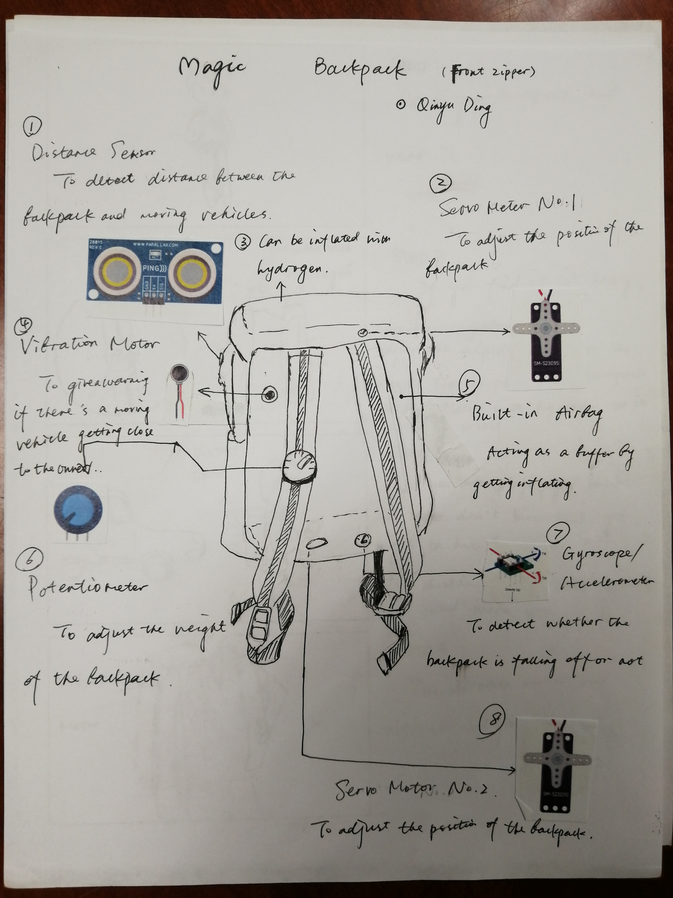 
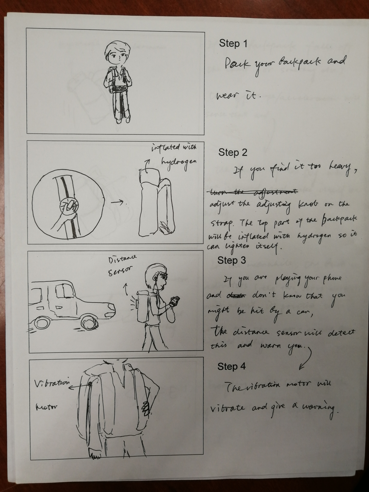 
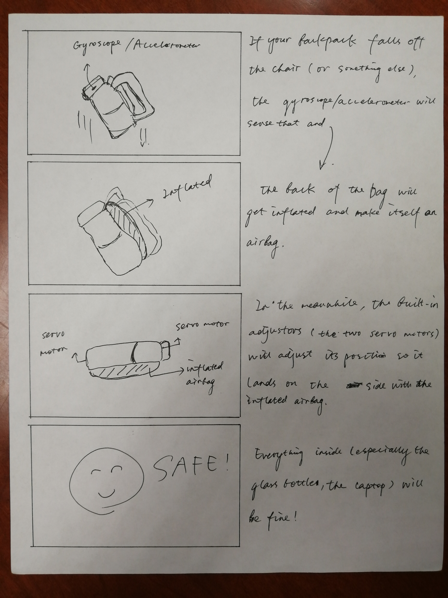 

## HW2: Spaceship Interface
#### [Code](./codes/Spaceship.ino)
  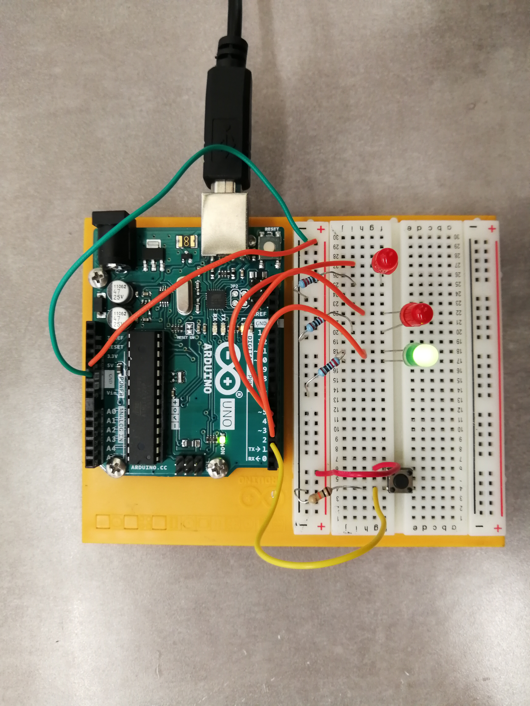 
    

## HW3: Userflow
  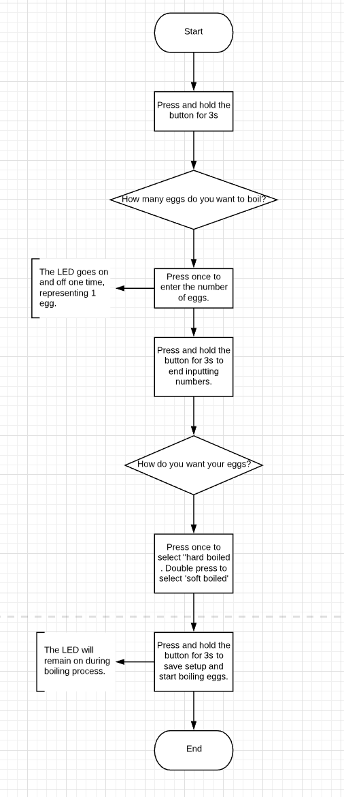 
## HW4: Love-O-Meter and Color Mixing Lamp
  * Love-O-Meter
#### [Code](./codes/Love-o-Meter.ino)
   
    
  * Color Mixing Lamp
#### [Code](./codes/color-mixing-lamp.ino)
  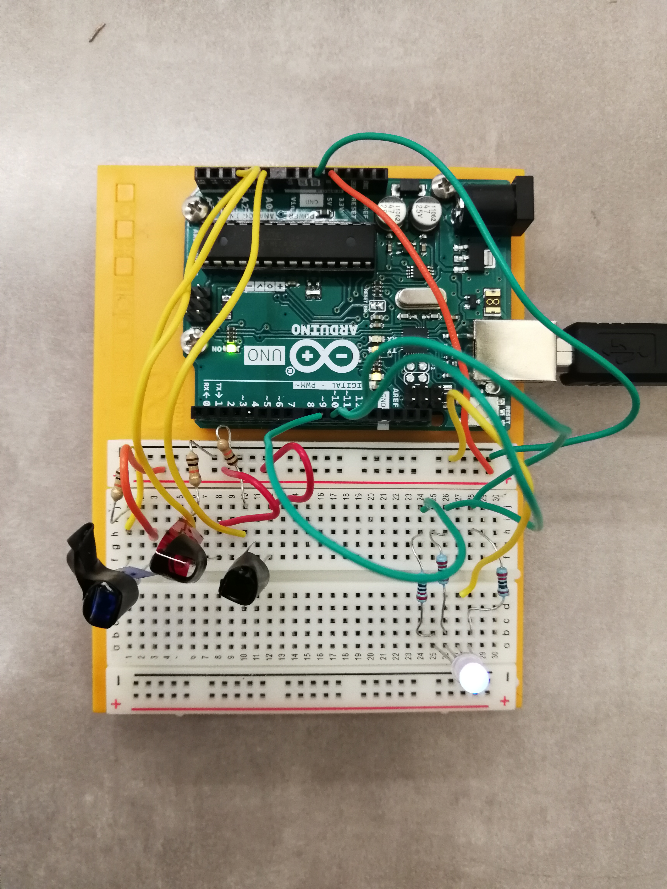 
     
## HW5: Knock Lock and Sensor Walk
  * Knock Lock
#### [Code](./codes/Knock-lock.ino)
  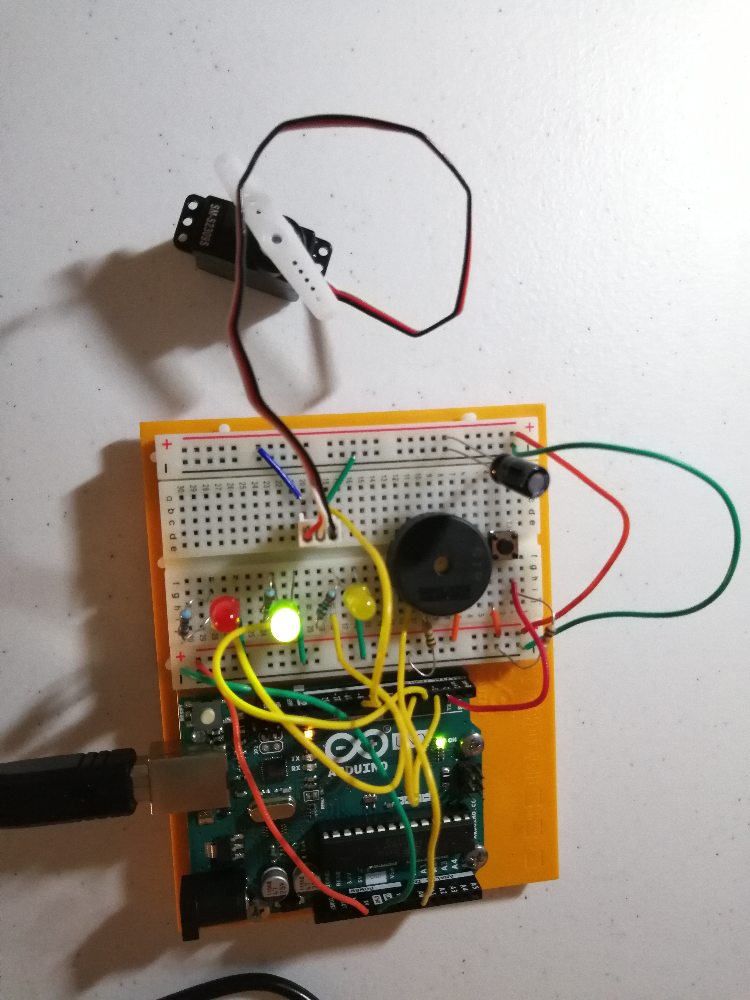 
    
  * Sensor Walk
    * Bottle Filling Station  
     > 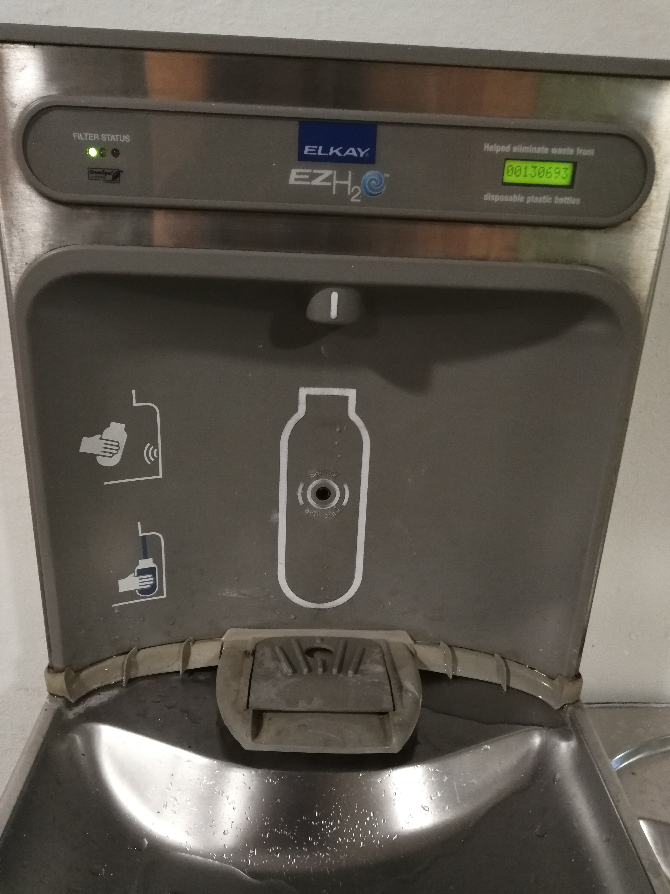
     > 

     > Active Input  
    > Sensor: Proximity sensor  
    > Output: Water  
    > Its output is active. Water will come out when triggered.    
    

    * Voice-Activated Street Lamp 
    > 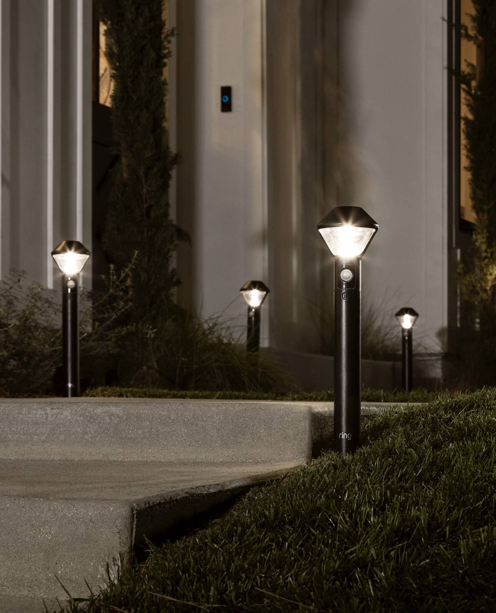
    > 

    > Active Input  
    > Sensor: Sound sensor  
    > Output: Light  
    > Its output is active. The light will turn on when triggered.    
    

    * Automatic Towel Paper Dispenser 
    > 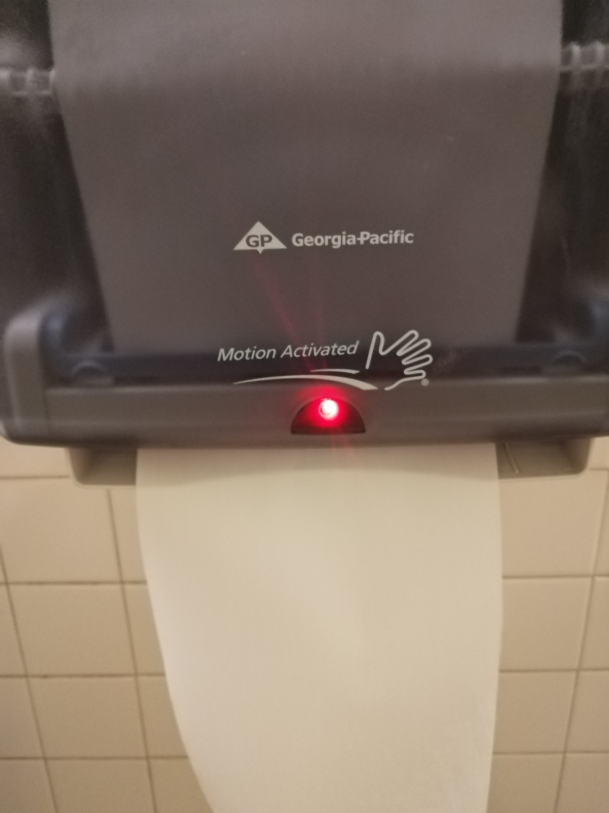
    > 

    > Active Input  
    > Sensor: Motion sensor  
    > Output: Paper  
    > Its output is active. Paper will come out when triggered.    
    

    * Escalator 
    > 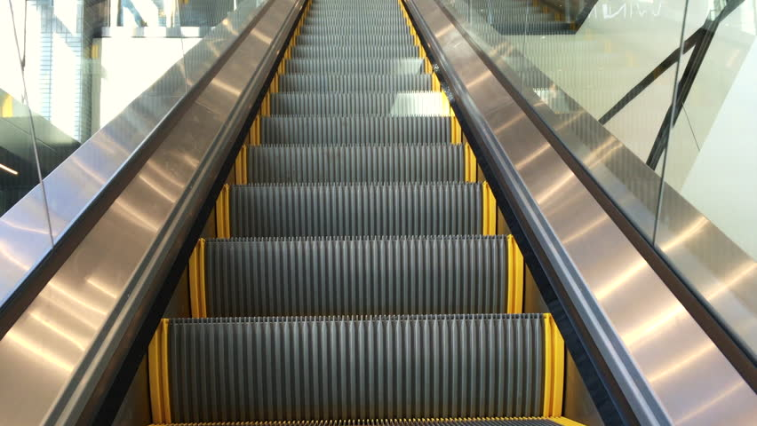
    > 

    > Active Input  
    > Sensor: Weight sensor  
    > Output: Movement  
    > Its output is active. The escalator will start moving will when triggered.    
    

    * Lift (weight limit) 
    > 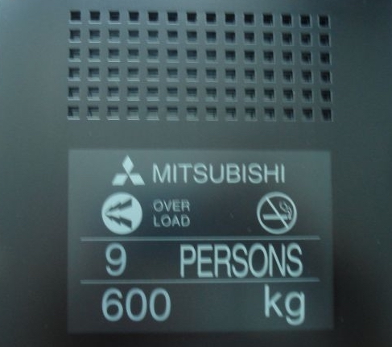
    > 

    > Active Input  
    > Sensor: Weight sensor  
    > Output: Sound  
    > Its output is active. The alarm will go off when the amount of people in the lift exceeds the maximum weight limit.    
    

    * Street Crossing Button 
    > 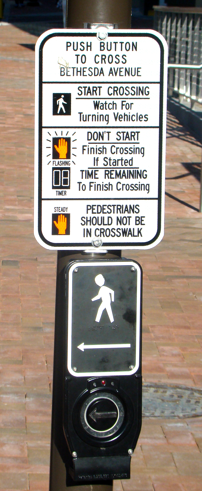
    > 

    > Passive Input  
    > Sensor: Button  
    > Output: Sound  
    > Its output is active. It will make a voice warning saying 'Wait!' when the button is pushed.    
    

## [Midterm](../Midterm Project)
