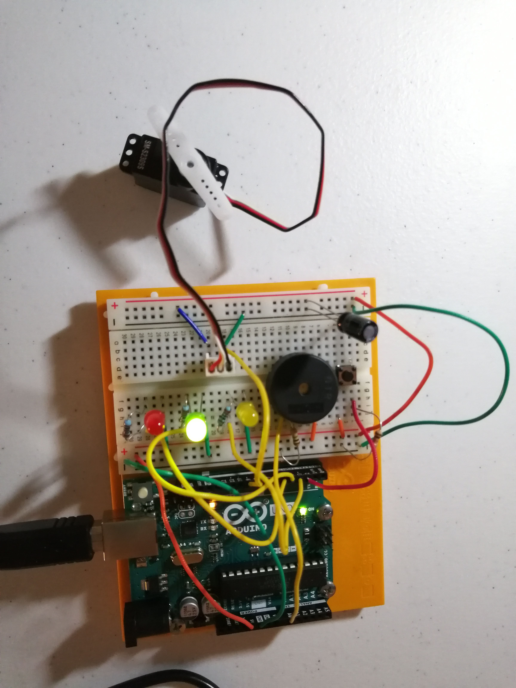
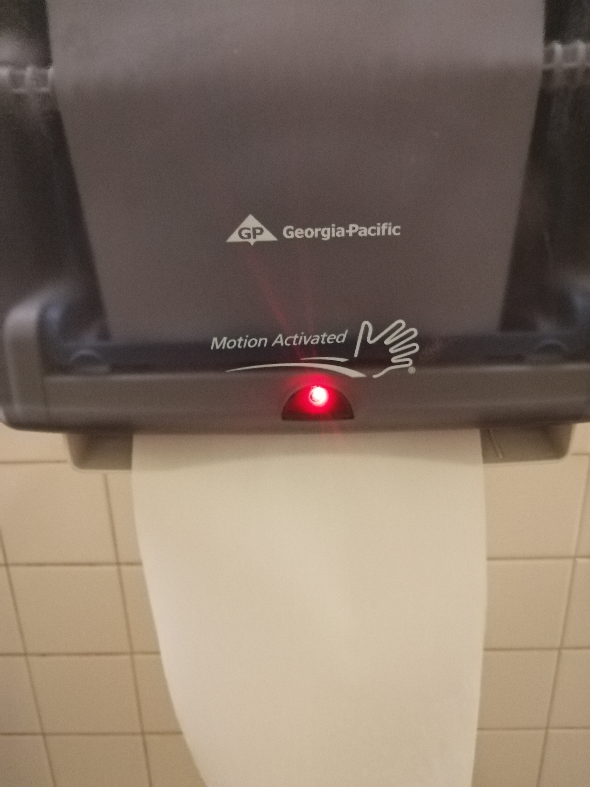
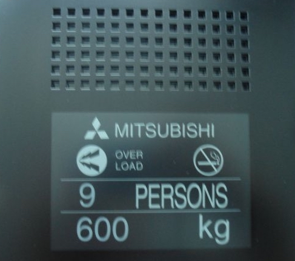

* Knock Lock
#### [Code](../codes/knock-lock.ino)
 
  
* Sensor Walk
  * Bottle Filling Station  
   > 
   > 

   > Active Input  
  > Sensor: Proximity sensor  
  > Output: Water  
  > Its output is active. Water will come out when triggered.    

  * Voice-Activated Street Lamp 
  > 
  > 

  > Active Input  
  > Sensor: Sound sensor  
  > Output: Light  
  > Its output is active. The light will turn on when triggered.    

  * Automatic Towel Paper Dispenser 
  > 
  > 

  > Active Input  
  > Sensor: passive Infrared Sensor  
  > Output: Paper  
  > Its output is active. Paper will come out when triggered.    

  * Escalator 
  > 
  > 

  > Active Input  
  > Sensor: Weight sensor  
  > Output: Movement  
  > Its output is active. The escalator will start moving will when triggered.    

  * Lift (weight limit) 
  > 
  > 

  > Active Input  
  > Sensor: Weight sensor  
  > Output: Sound  
  > Its output is active. The alarm will go off when the amount of people in the lift exceeds the maximum weight limit.    

  * Street Crossing Button 
  > 
  > 

  > Passive Input  
  > Sensor: Button  
  > Output: Sound  
  > Its output is active. It will make a voice warning saying 'Wait!' when the button is pushed.    

* Potential Matches
  * [Proximity Sensor](https://www.amazon.com/IronBuddy-HC-SR04P-Ultrasonic-Measuring-Transducer/dp/B07Q7NDB68/ref=sr_1_7?keywords=proximity+sensor&qid=1557369769&s=gateway&sr=8-7)
  * [Weight Sensor - Load Cell](https://learn.sparkfun.com/tutorials/getting-started-with-load-cells)
  * [Sound Sensor - Sound Detector](https://learn.sparkfun.com/tutorials/sound-detector-hookup-guide?_ga=2.4540467.1044965918.1557369897-349644450.1550779801)
