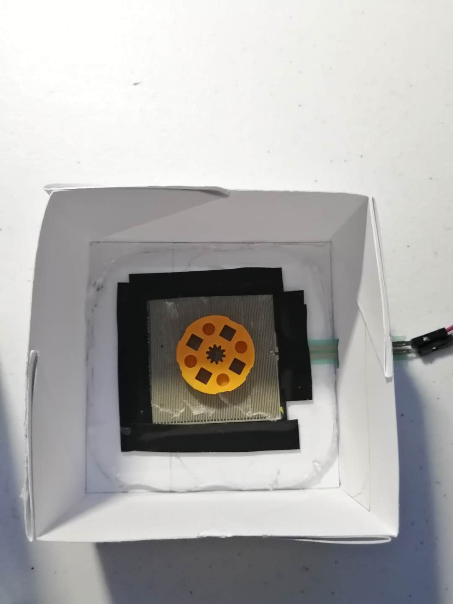
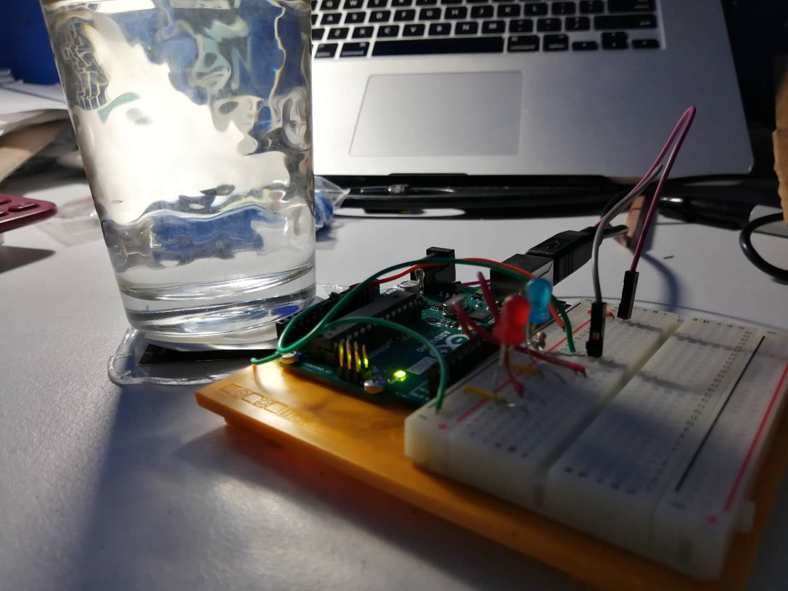
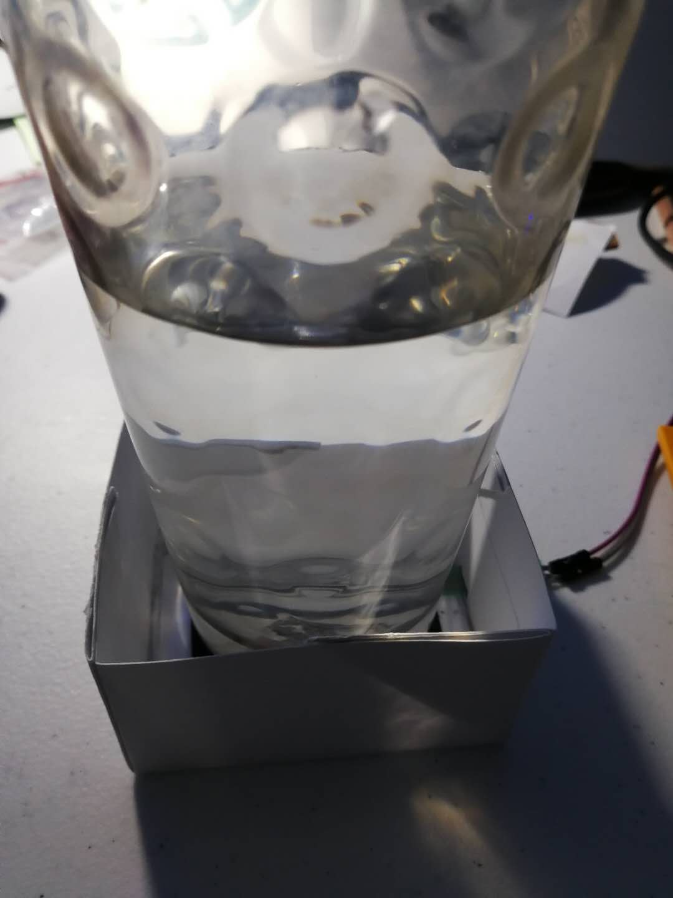
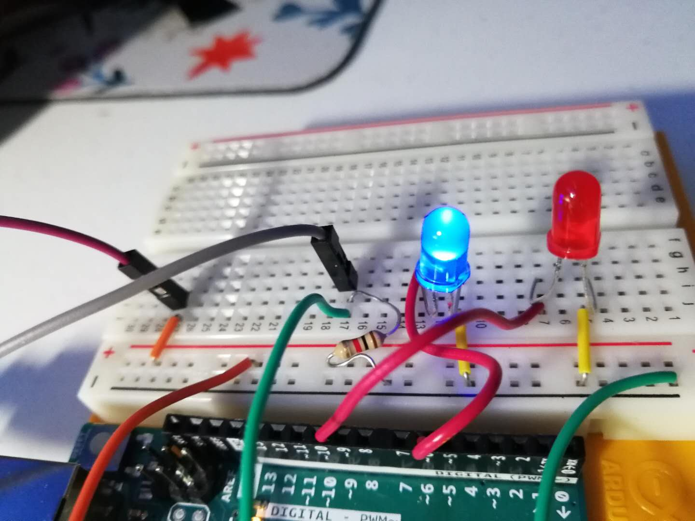
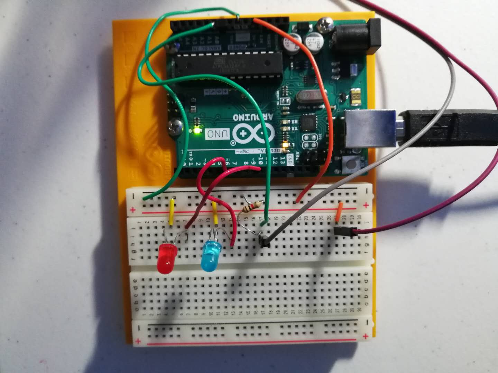

# WATER TIME
## What is the title of your project?
Water Time
## Briefly explain why did you want to make this project?
Study has shown that across the world, at all stages of life, most people live in a status of dehydration. The average American only drinks 1.8 cups a day which is significantly less than the 8.5 cups a day that are recommended by the European Hydration Institute. It takes only a 2% loss of total water content for your body to start feeling thirsty. Once you’re at this point your body is already in a state of dehydration. The most recommended way to keep ourselves hydrated is regular water intake. Therefore, I want to make a machine that can reminds people to drink water regularly.

## Who are the stakeholders?
Anyone who has a busy schedule and often forgets to drink water to keep hydrated. For example: students, teachers, office workers.
## Find 3 inspiring projects

## **Code**
[Codes are here](./WaterTime.ino)
  ## How does your program work? (Explain your code)
  * When a user put a container with water on the shelf, the Arduino starts to read the input of this FSR(Force Sensitive Resistor). Both output for the two lights will be set as HIGH. **flagCup** will change from 0 to 1, indicating a container has been put on the shelf.
  * I set a variable called **stable** to see whether the input is stable or not. Once the flunctuation is less than 4, **stable** increases 1. Once stable reaches the standard that was set for the "stable state", the **flagTimingState** changes from 0 to 1, the machine will store the weight it measures and start timing. The red light will set as LOW.
  * Once the container is lifted up, the input of the FSR will fall under a threshold(**VOL_DIV**) (Here it won't goes drops to 0 because there's voltage on the blue light.) The blue light will be set to blink.
  * If the container is lifted up during the prescribed water-drinking intervals, which means the red light hasn't started blinking (**flagAlert** = 0), **flagCup** will change from 0 to 3, indicating a container which was on the shelf before has been lifted up prior to the prescribed drinking time. Everything will start over. All the flag variables will be reset to initial value. And the timer will start over.
  * If the container hasn't been moved for a prescribed period of time, **flagAlert** will change from 0 to 1. The red light will be set to blink.
  * Now, it the the user raises the container after the interval, **flagCup** will change to 2 indicating that the container is lifted after the the time the user is supposed to drink water.
  * After the user puts back the container, if **flagCup** equals 2, the machine will remeasure the weight again and compare to the last one to see if the user has drunk enough water. That means, if the change of the FSR is less than a threshold(**drinkStandard**), the red light will be set to HIGH.
  * If the user puts back the container after drinking enough amount of water, everything will start over. All the flag variables will be reset to initial value. And the timer will start over.

## **Reflection**
## What worked/did not work?
    * What worked: the LED lights. The FSR can measure the force, in some way.
    * What didn't work:  The FSR cannot reach a stable value. The input keeps increasing when something remains still on the shelf. And even if the exactly same thing is put on the shelf, the measurement can be different.

## If you had more time what would you change in your project?
    * Fix the measurement issue. So that I can calculate the amount of water a user just took.
    * Reduce measurement time.
    * Make richer output like sound, vibration, etc.

## **Components**
## What parts did you use?
### PARTS FOR INPUT
      * One force sensitive Sensor
        I needed an input that can respond to the change of the container's weight.
### PARTS FOR OUTPUT
    * One blue LED light
    * One red LED light
    I needed something that has different attributes to indicate different state of the machine and also communicate a variety of messages to users.

## Which are your inputs/outputs
### INPUT
    The input is the weight of the container that users put on, including the water in it.
    * Users put a container with water on the container shelf to trigger the machine.
    * Once something is put on it, Water Time will start to measure its weight. It takes a few seconds for the machine to get a stable measurement and then it starts timing.
    * If users lift up the container, the weight will become 0 and Water Machine will know that the container has been moved off the shelf.
    * Once users finish drinking water and put the container back on the shelf, Water Time will start to measure its weight again.
    ### OUTPUT
    The output are two lights. The color, the frequency of lights.
    * When Water Time is measuring the weight of container put on it, both the red light and the blue light will go on.
    * Once the measurement becomes stable and Water Time starts to time, only the blue light remains on while the red one goes off.
    * As long as the container is moved off the shelf, the blue light starts blinking slowly, indicating users are drinking water.
    * If the container haven't been moved for a certain period of time, which means users haven't drunk water for a long time, the red light will start blinking to remind users it's time to drink water. The blue light will goes off at this moment.
    * If users only take a sip and put the container down on the shelf, the red light will stay on to suggest users to drink more.
    * Once users drink enough water, everything will become normal again. The timer will start over.

## **Interaction**
## Explain how a user interacts with your input/output**
## Create a layout for your interface
## Storyboard the interaction
## Draw a step by step diagram of the interaction

## Explain how the project is used?
## How does the user interact with the input
## Why did you decide to use that component?
## Explain how the input translates to the output

## Talk about what form factor/size your project would ideally be.
This project would ideally be a book-size.

## **Images and Videos**
## Progress images

## Finished input

## Finished output

## Finished Breadboard

## Video
[WATER TIME!](https://youtu.be/0R5WKP5XWsA)
